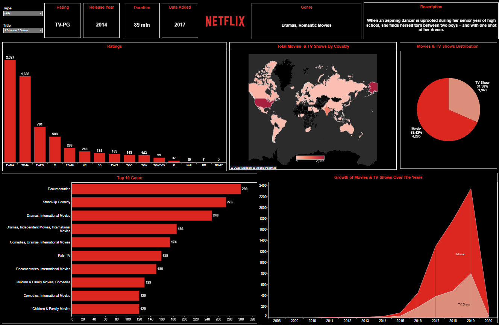

# Netflix Dashboard

# Company Name: Netflix, Inc.

-----

### Tableau Public Dashboard Link:-
https://public.tableau.com/views/NetflixDashboard_17774377153630/NetflixDashboard?:language=en-US&:sid=&:redirect=auth&:display_count=n&:origin=viz_share_link

-----

### Project Summary:-
This project is an interactive **Netflix Data Dashboard** built to analyze and visualize trends in **movies and TV shows**. It provides insights into **Content Distribution, Ratings, Genres, and Growth Patterns over time**.
  - Content Trends across Years
  - Distribution of Movies vs TV shows
  - Popular Genres
  - Ratings Breakdown

-----

### Dataset Description (After Cleaning):-
The dataset consists of **6,235 records** with **12 structured columns**.

### Columns Name (Original Columns Name):-
- show_id
- type
- title
- director
- cast
- country
- date_added
- release_year
- rating
- duration
- listed_in
- description
 
-----

### Tools and Techniques Used:-
- Data Cleaning.
- Tableau:
    - Interactive Dashboards.
    - Data Visualization.

 -----

### Objectives:-
- Analyze Netflix content dataset.
- Build an interactive and visually appealing dashboard.
- Identify trends in content growth and distribution.
- Provide actionable insights using data visualization.

-----

### Project Structure:-
Netflix Dashboard
Dashboard/: "Netflix Dashboard.twbx" file.
Data/: Dataset.
Insights/: Business Insights & Recommendations.
README.md: Project Documentation.
 
-----

### Dashboard Preview:-

-----

### Author:-
Yash Sonar
BBA Student | Aspiring Data Analyst

-----
